# Laporan Praktikum Pertemuan Minggu 01
# Konfigurasi Git
1. Konfigurasi Git menggunakan perintah di bawah ini(1.png) memasukkan username git dan email yang terdaftar di git.

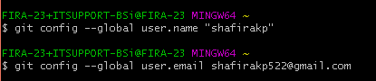

2. mengecek konfigurasi di git apakah yang nama dan email yang di masukkan sudah sesuai dengan yang terdaftar di Git.

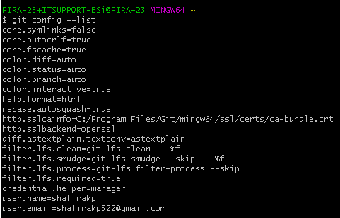

3. Mengelola Repo Sendiri di Account Sendiri
Pada kanan atas klik + kemudian New Repository setelah di klik isikan nama, keterangan serta lisensi kemudian klik create Repository.

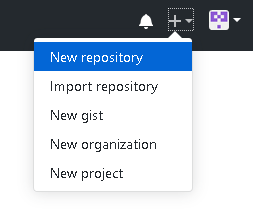

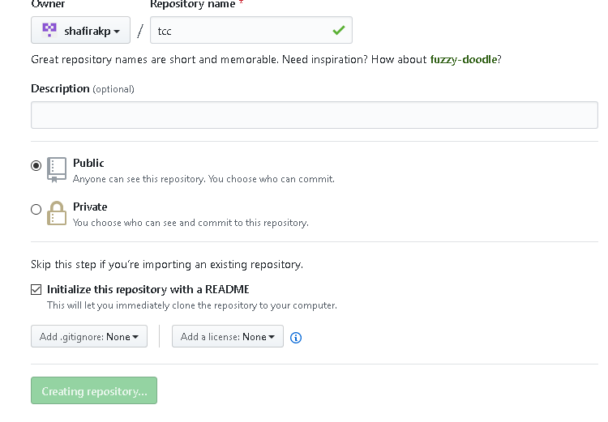

3. Clone Repo adalah proses untuk menduplikasi remote repo di GitHub ke komputer lokal. Copy url yang terdapat di menu Clone atau download.

#Mengubah Isi - Push Tan[a Brancing dan Merging
4. vim README.md : perintah ini berfungsi untuk mengedit/mengisi file README ketika di enter kemudian klik i yang berfungsi untuk mengetikkan isi di file tersebut # My Awesome Project setelah di isi kemudian klik esc :wq yang berfungsi untuk menyimpan.
   cat README.md : perintah ini berfungsi untuk melihat isi yang ada di file README.md .

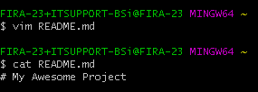

5. git status : perintah ini berfungsi untuk mengetahui status dari repository lokal.

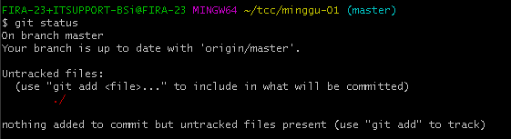

6. git add -A : perintah ini berfungsi menambahkan file yang ada.

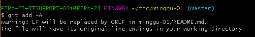

7. git commit -m "Add: README.md" : perintah ini berfungsi untuk menyimpan perubahan dan -m untuk menambahkan keterangan.

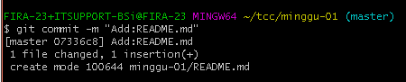

8. git push origin master : berfungsi untuk meng push file ke repository GitHub pada branch master kemudian akan muncul jendela baru untuk login ke github.

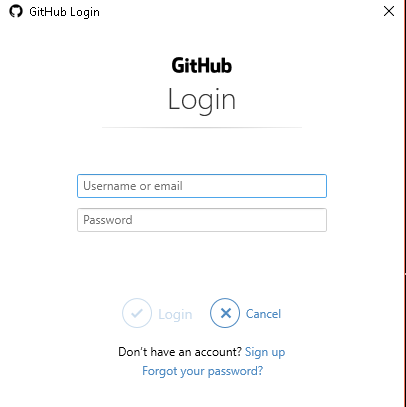

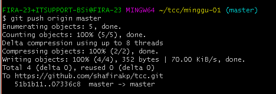

# Mengubah isi dengan Branching and Merging
9. git checkout -b edit-readme-1 : berfungsi untuk membuat branch baru dengan nama edit-readme-1 kemudian pindah ke branch tersebut.

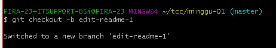

10. vim README.md : perintah ini berfungsi untuk mengedit/mengisi file README ketika di enter kemudian klik i yang berfungsi untuk mengetikkan isi di file tersebut # My Awesome Project Ini isi Project setelah di isi kemudian klik esc :wq yang berfungsi untuk menyimpan
   cat README.md : perintah ini berfungsi untuk melihat isi yang ada di file README.md .

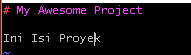

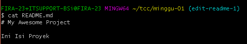

11. git status : untuk fungsi sudah di jelaskan di nomor 5.

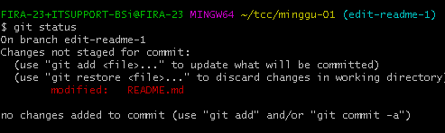

12. git add -A : untuk fungsi sudah dijelaskan di nomor 6.

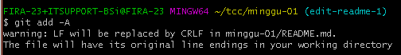

13. git commit -m "ADD : isi REAFME.md"  : untuk fungsi sudah di jelaskan di nomor 7.

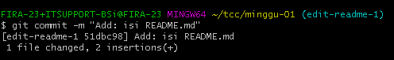

14. git checkout master : untuk pindah ke branch master.

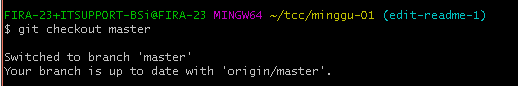

15. git status : untuk fungsi sudah di jelaskan di nomor 5.

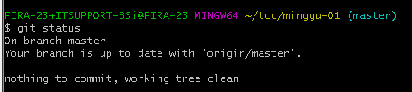

15. git push origin edit-readme-1 : berfungsi untuk meng push file ke repository GitHub pada branch edit-readme-1 kemudian akan muncul jendela baru untuk login ke github.

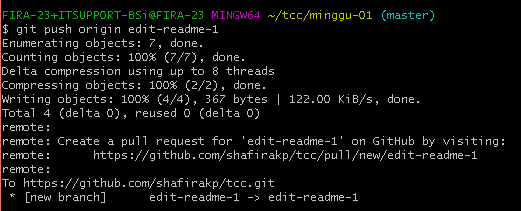

# Pull Request (PR)
16. menambah pull Request.

17. setelah pull request terbuat kemudian klik merge pull request setelah intu confirm merge, branch yang kita kirimkan tadi sudah dimasukkan ke branch master jika berhasil maka akan ada keterangan seperti gambar di bawah ini.

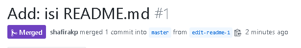

Hasil.

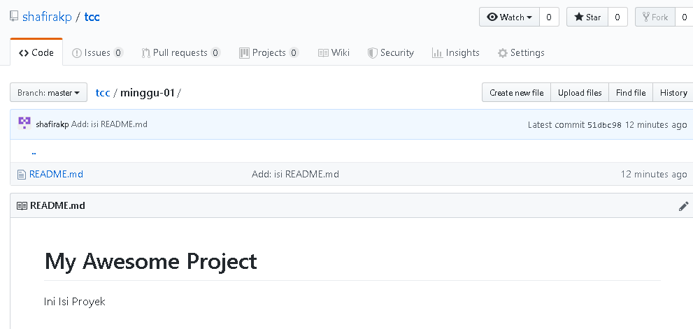

18. git merge edit-readme-1 berfungsi untuk me merge pull Request.

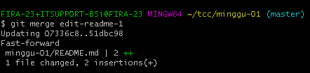

19. git branch -D edit-edit-readme-1 berfungsi untuk menghapus branch edit-readme-1.

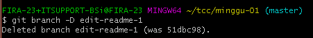

20. git branch berfungsi untuk melihat Branch.

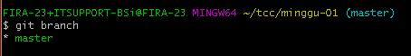

21. git pull berfungsi untuk sinkronisasi github ke lokal.

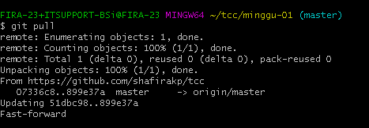
