# Laporan Praktikum Pertemuan Minggu 02
1. Pindah ke folder tcc, melihat file yang ada di folder tcc, membuat file minggu-02, pindah ke minggu-02, pada saat saya mengerjakan programnya tetap saya masukkan di file minggu-01, di minggu-02 hanya berisi image dan laporan minggu-02.

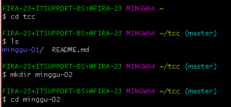

# Membatalkan perubahan
2. git checkout -b edit-readme-2 : perintah ini berfungsi untuk menukar branch yang aktif dengan branch yang di pilih dan sekaligus membuat branch baru, dan branch yang di pilih adalah edit-readme-2.

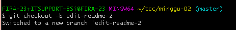

3. VIM README.md : perintah ini berfungsi untuk mengedit/mengisi file README ketika di enter kemudian tekan i yang berfungsi untuk mengetikkan isi di file tersebut # My Awesome Project Ini isi proyek. Jadi agak kacau nih, setelah di isi kemudian tekan esc :wq yang berfungsi untuk menyimpan.

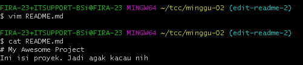

4. git checkout master : perintah ini berfungsi untuk pindah ke branch master.

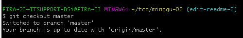

5. cat README.md : berfungsi untuk melihat isi yang ada di file README.md.

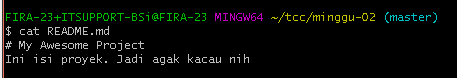

6. git branch -D edit-readme-2 : perintah ini berfungsi untuk menghapus branch edit-readme-2.

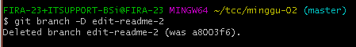

7. git branch : perintah ini berfungsi untuk melihat branch dan terdapat branch master.

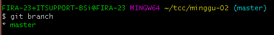

8. cat README.md : perintah ini berfungsi untuk melihat isi yang ada di file README.md.

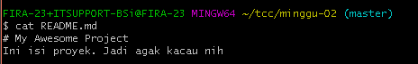

9. git reset --hard : perintah ini berfungsi untuk melakukan format secara paksa kemudian melihat hasilnya dengan membuka isi dari file README.md.

# Undo Commit Terakhir
10. cat README.md : perintah ini berfungsi untuk melihat isi yang ada di file README.md.

11. git log --oneline : perintah ini berfungsi untuk melihat riwayat repositori.

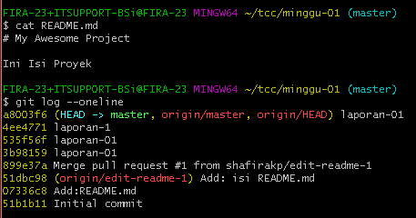

12. VIM README.md : perintah ini berfungsi untuk mengedit/mengisi file README.md.

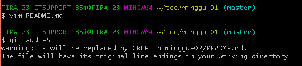

13. git add -A :  perintah ini berfungsi menambahkan file yang ada.

14. git commit -m "Add: contents" : perintah ini berfungsi untuk menyimpan perubahan dan -m untuk menambahkan keterangan.

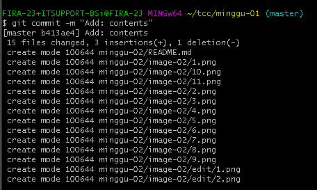

15. git push origin master : berfungsi untuk meng push file ke repository GitHub pada branch master.

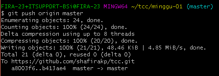

16. VIM README.md : perintah ini berfungsi untuk mengedit/mengisi file README.md.

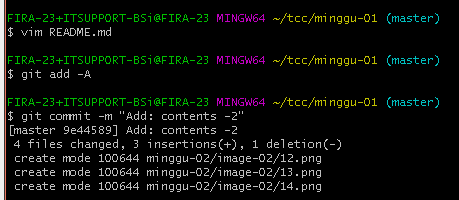

17. git add -A : perintah ini berfungsi menambahkan file yang ada.

18. git commit -m "Add: contents - 2" : perintah ini berfungsi untuk menyimpan perubahan dan -m untuk menambahkan keterangan.

19.  git push origin master : berfungsi untuk meng push file ke repository GitHub pada branch master.

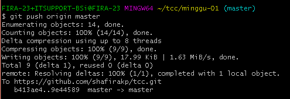

20. cat README.md : perintah ini berfungsi untuk melihat isi yang ada di file README.md.

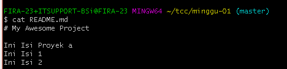

21. git status : perintah ini berfungsi untuk mengetahui status dari repository lokal.

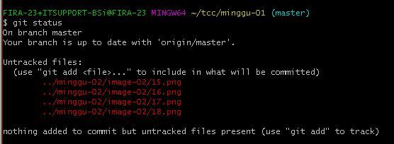

22. git revert HEAD : perintah ini berfungsi untuk membuka editor. Pada editor tersebut kita bisa mengetikkan pesan revert ( = pesan commit untuk pembatalan).

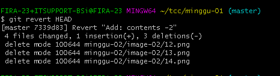

23. git status : perintah ini berfungsi untuk mengetahui status dari repository lokal.

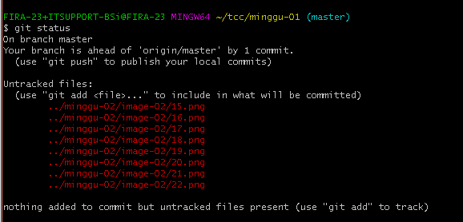

24. git push origin master : berfungsi untuk meng push file ke repository GitHub pada branch master.

25. cat README.md : perintah ini berfungsi untuk melihat isi yang ada di file README.md. Pada praktik ini sebelumnya README.md saya isi #My Awesome Project Ini Isi proyek Fira.

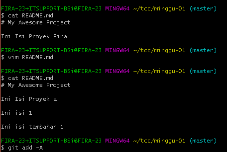

26. vim README.md : perintah ini berfungsi untuk mengedit/mengisi file README.md. Dan edit isi README.md

27. cat README.md : perintah ini berfungsi untuk melihat isi yang ada di file README.md.

28. git add -A : perintah ini berfungsi menambahkan file yang ada.

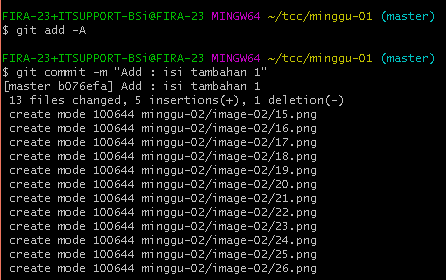

29. git commit -m "Add: isi tambahan 1" : perintah ini berfungsi untuk menyimpan perubahan dan -m untuk menambahkan keterangan.

30. git status : perintah ini berfungsi untuk mengetahui status dari repository lokal.

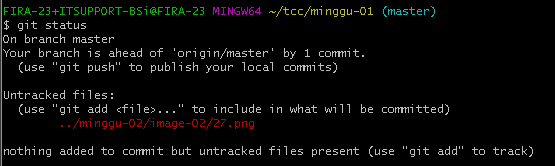

31. git log --oneline : perintah ini berfungsi untuk melihat riwayat repositori.

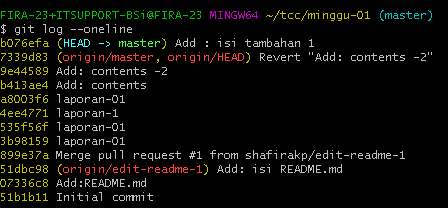

31. git reset --hard HEAD^ : perintah ini berfungsi untukmelakukan format secara paksa kemudian melihat hasilnya dengan membuka isi dari file README.md.

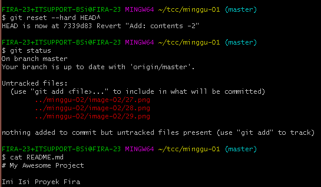

32. git status : perintah ini berfungsi untuk mengetahui status dari repository lokal.

33. cat README.md :  perintah ini berfungsi untuk melihat isi yang ada di file README.md. Setelah di reset maka isi akan berubah ke awal.

34. cat README.md : perintah ini berfungsi untuk melihat isi yang ada di file README.md. Setelah di reset maka isi akan berubah ke awal.

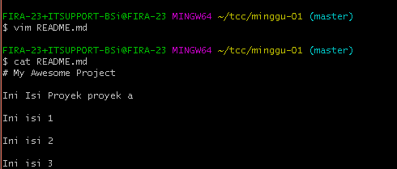

35. git log --oneline : perintah ini berfungsi untuk melihat riwayat repositori.

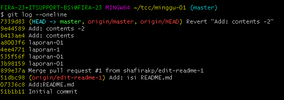

36. git revert a7615fb : perintah ini berfungsi untuk kembali ke perubahan pada saat yang sudah lama output yang dihasilkan fatal karena a7615fb harusnya disamakan pada saat proses git log file mana yang akan dikembalikan

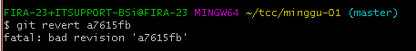

37. cat README.md : perintah ini berfungsi untuk melihat isi yang ada di file README.md. vim README.md : berfungsi untuk mengisi dan kemudian di cat lagi untuk melihat isi

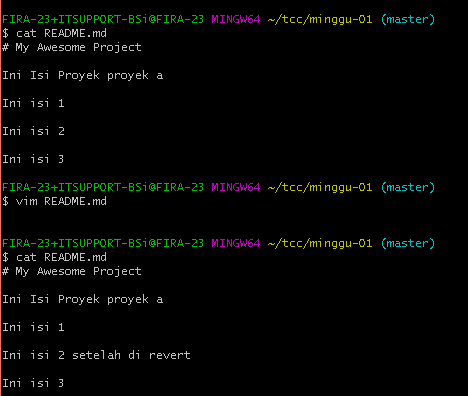

38. git revert --continue : perintah ini berfungsi untuk melanjutkan kembali ke perubahan pada saat yang sudah lama.

39. git push origin master : berfungsi untuk meng push file ke repository GitHub pada branch master.

