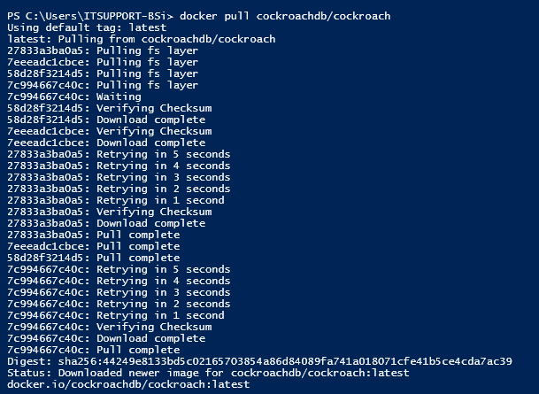
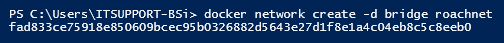
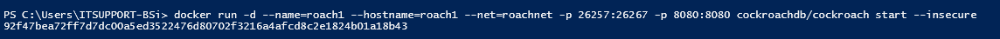
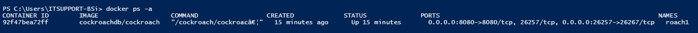
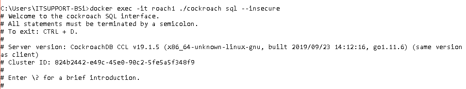
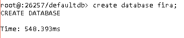
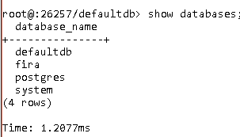
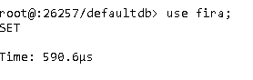
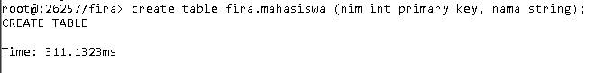
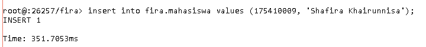

# Laporan Praktikum Pertemuan Minggu 05

1. Install Docker di laptop
2. Membuka terminal di laptop
3. Menjalankan perintah pull image cockroachdb, dan tunggu hingga selesai, pada proses ini cukup memakan waktu yang lama.

4. Membuat Bridge Network pada docker

5. Menjalankan perintah service cockroachdb.

6. Memastikan Container dalam keadaan UP.

7. Test Cluster.

8. Membuat database dengan nama Fira.

9. Melihat database yang ada di sistem.

10. Memilih database yang akan digunakan.

11. Membuat table mahasiswa di dalam database Fira.

12. Menginputkan data ke dalam tabel mahasiswa.

13. Melihat data tabel.

