# Laporan Praktikum Pertemuan Minggu 06

1. Running A Container
- docker search redis berfungsi untuk mencari Image Redis yang ada di docker hub.

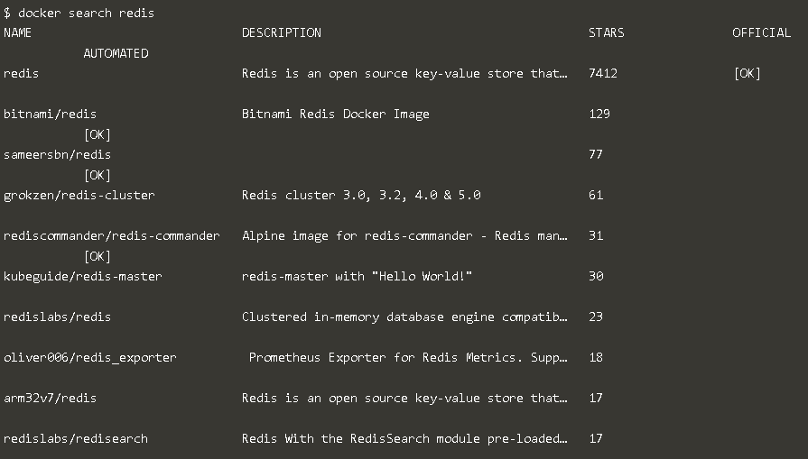

-docker run -d redis berfungsi untuk menjalankan image redis pada background.

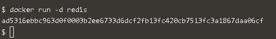

2. Finding Running Containers
- docker ps berfungsi untuk melihat containers yang sudah berjalan.

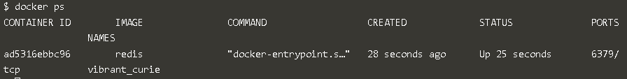

-docker inspect vibrant_curie berfungsi untuk melihat detail containers.

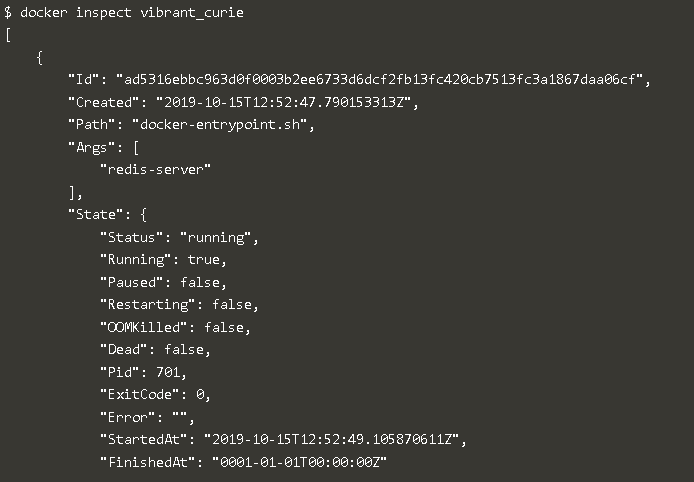

- docker logs vibrant_curie berfungsi untuk melihat logs pada sebuah containers yang running

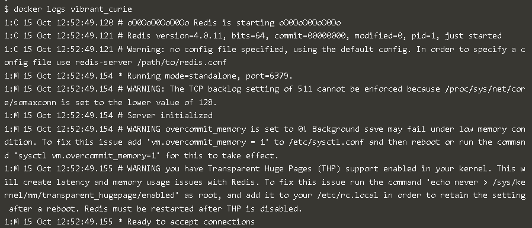

3. Accessing redis
- docker run -d --name redisHostPort -p 6379:6379 redis:latest berfungsi untuk menjalankan container redisHostPort pada background.

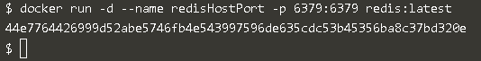

4. Accessing redis
- docker run -d --name redisDynamic -p 6379 redis:latest berfungsi untuk menjalankan container redisDynamic pada background.

- docker port redisDynamic 6379 berfungsi untuk melihat list mapping port.

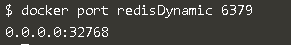

- docker ps berfungsi untuk menjalankan container ubuntu dengan menggunakan comment ps.

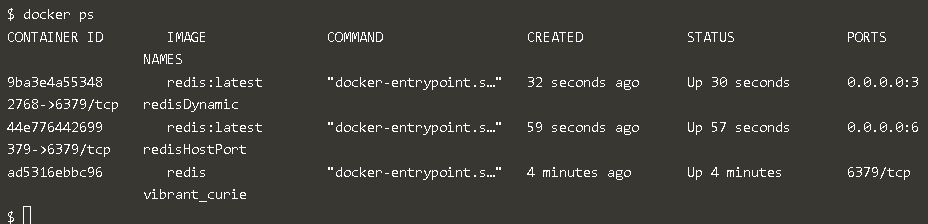

5. Persisting Data
- docker run -d --name redisMapped -v /opt/docker/data/redis:/data redis berfungsi untuk memapping container ke port tersebut.

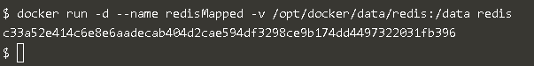

6. Running A Container In The Foregroun
- docker run ubuntu ps berfungsi untuk menjalankan container ubuntu yang disertai dengan comment ps.

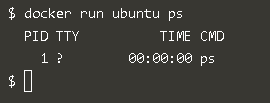

- docker run -it ubuntu bash berfungsi untuk masuk ke dalam container ubuntu.

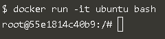

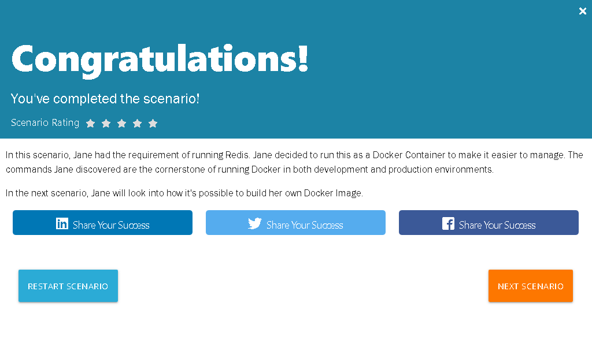

1. Create Dockerfile

- membuat dockerfile.

2. Build Docker image

- docker build -t webserver-image:v1 berfungsi untuk membuat gambar statis HTML.

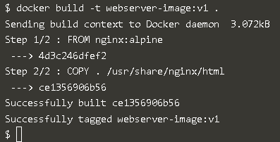

- docker image berfungsi untuk melihat list semua gambar yang ada di host yang digunakan.

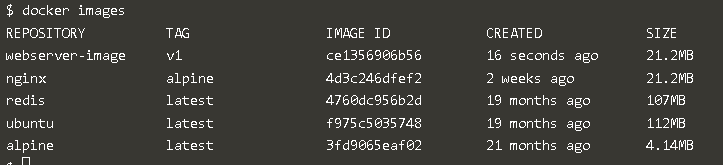

3. Run
- docker run -d -p 80:80 webserver-image:v1 berfungsi untuk membuat gambar dengan memberikan nama dan tag. Menggunakan port 80 karena web server dan menggunakan parameter -p.

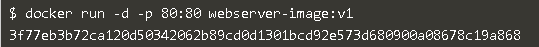

- curl docker berfungsi untuk

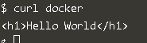

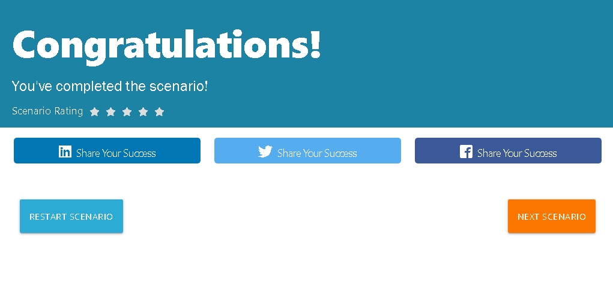

1. Base image
- mengcopy ke editor.

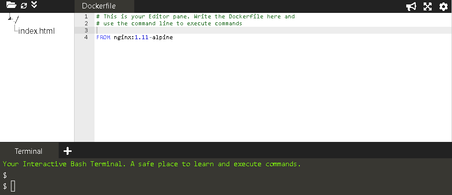

2. Running Commands
- mengcopy ke editor.

3. Exposing Ports

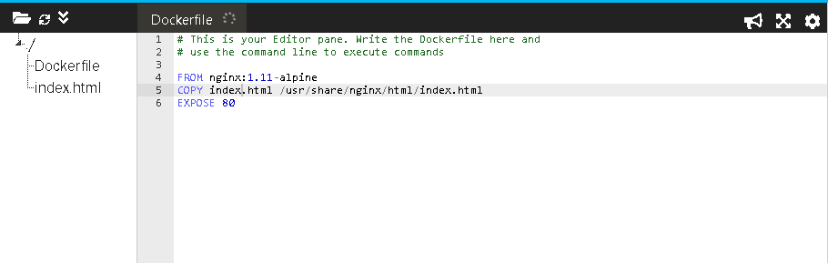

4. Default Commands

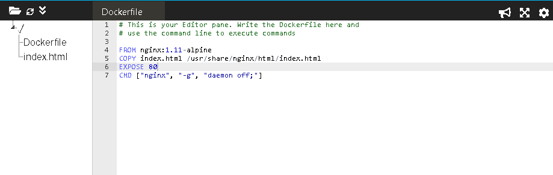

5. Building Containers
- docker build

 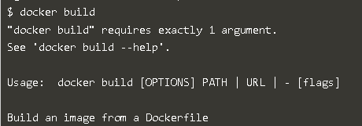

 - docker build -t my-nginx-image:latest berfungsi untuk membuat sebuah image dengan nama my-nginx-image:latest dimana image ini dibuild berdasarkan konfigurasi dari file dockerfile.

 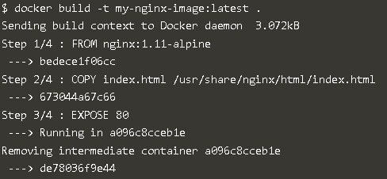

- docker image berfungsi untuk melihat list semua gambar yang ada di host yang digunakan.

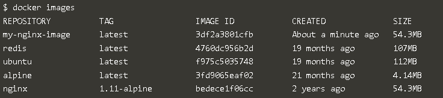

6. Launching New image
- docker run -d -p 80:80 my-nginx-image:latest

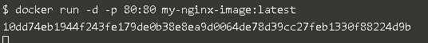

- curl -i http://docker berfungsi untuk

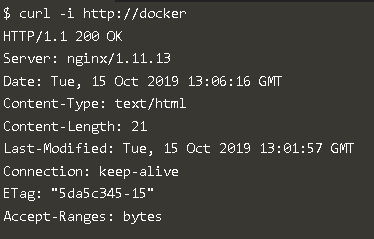
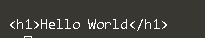

-docker  ps berfungsi untuk melihat containers yang sudah berjalan.

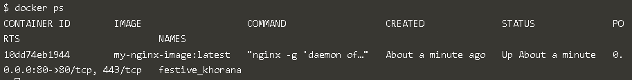
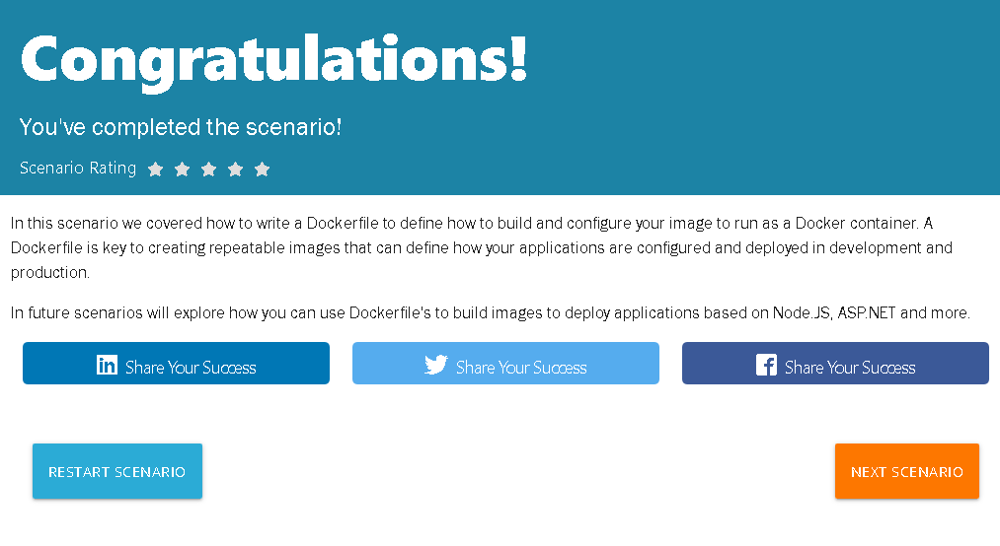
