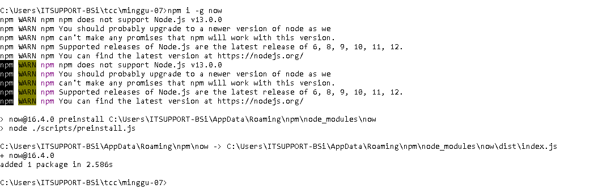
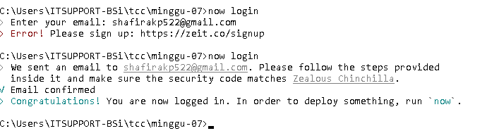
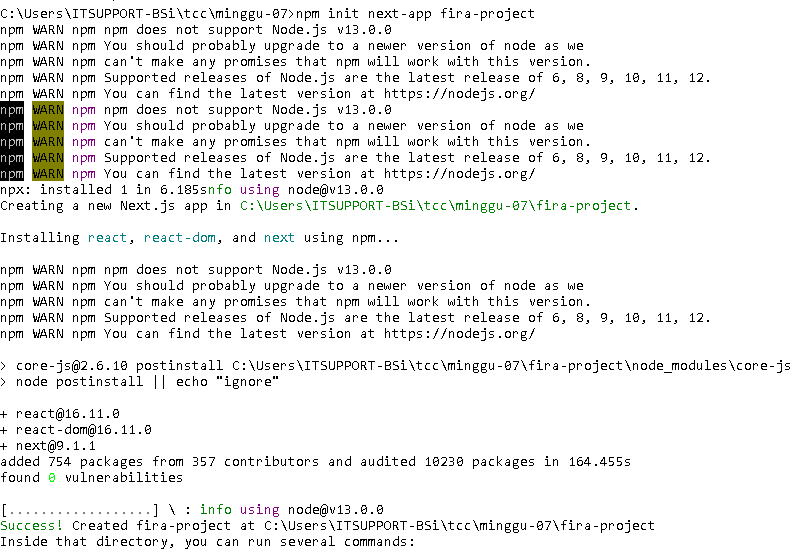
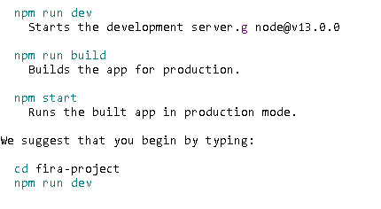
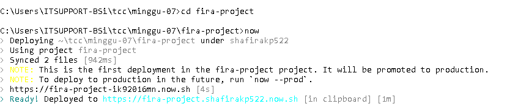
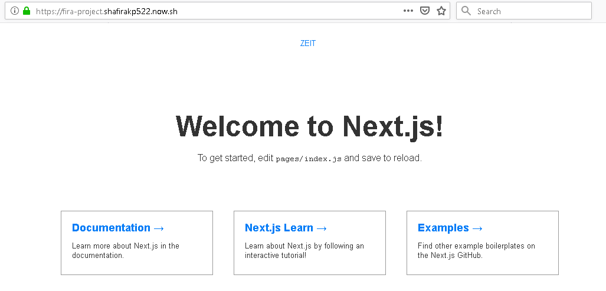

# Laporan Praktikum Pertemuan Minggu 07
# Zeit Now

1. Install Now CLI.

2. Login Now
-Setelah klik perintah tersebut maka akan diminta untuk memasukkan email yang sudah terdaftar di Zeit, setelah itu buka email dan akan ada pesan masuk dari email kemudian di confirm .

3. Creating a Project and Deploying
- perintah ini berfungsi untuk membuat project, saya membuat project bernama fira.

4. Menjalankan Project yang sudah di membuat.

5. Mengakses Hasil dari pembuatan project di https://fira-project.shafirakp522.now.sh

