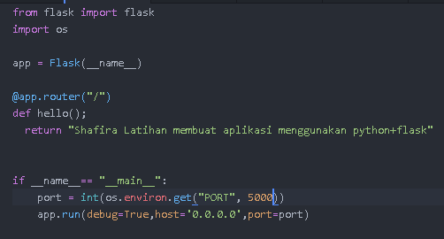
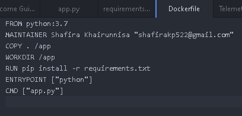
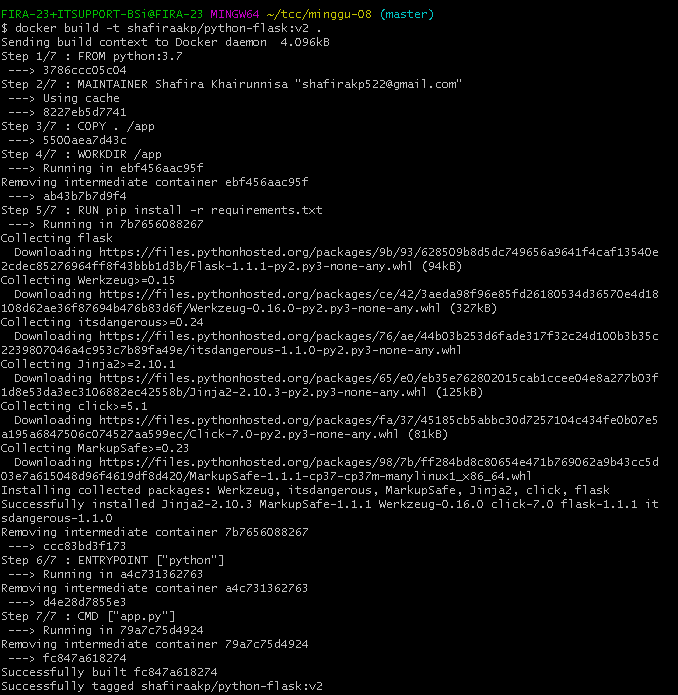
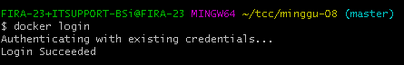
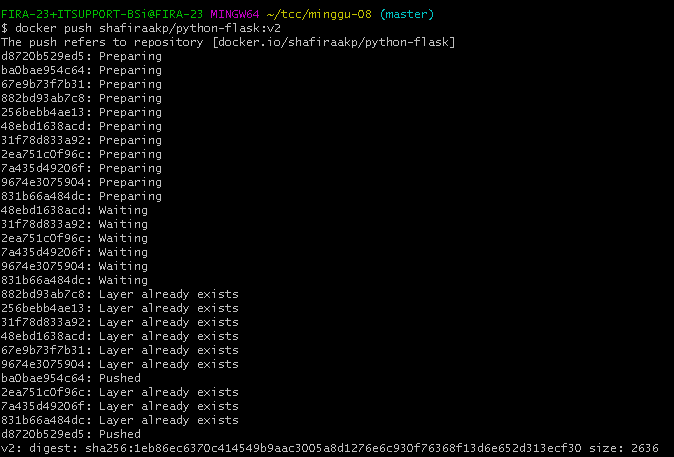
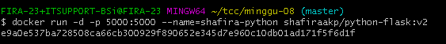
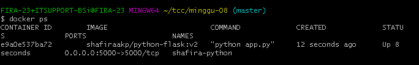

# Pythhon+flask

1. File app.py

2. File requirements.txt

3. File Dockerfile

4. Build images docker with command

5. Check images

6. Login Docker Hub

7. Push images

8. Image in Docker Hub
![](image-07/8.png

9. Run image with port 5000

10. Check container

11. http://localhost5000

