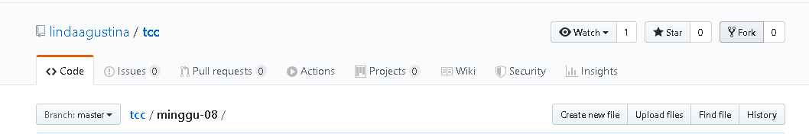

#Laporan Pertemuan Minggu 9
Laporan Pertemuan Minggu 9 udah diselesaikan sebelumnya di pertemuan minggu 8

#Laporan Pertemuan Minggu 10
1. Login ke GitHub
2. Masuk ke repo yang akan kita fork, disini saya masuk ke repo milik teman saya yang bernama lindaagustina, saya masuk ke folder tcc/minggu-08 (https://github.com/lindaagustina/tcc-1.git).

3. Klik Fork yang ada pada kanan atas, setelah proses fork selesai maka tulisan Fork akan ke disable.

4. Clone, copy url

5. masuk ke git bash kemudian ketik kan git clone (url yang sudah di copy).

6. ls -la tcc-1/ perintah ini berfungsi untuk melihat list yang ada di folder.

7. git remote -v perintah ini berfungsi untuk melihat track repository.

8. git remote add upstream https://github.com/lindaagustina/tcc.git .

9. cd tcc-1 berfungsi untuk pindah folder.

10. vi Readme.md berfungsi untuk mengedit file readme.

11. cat Readme.md berfungsi untuk melihat isi dari file Readme.

12. git add -A berfungsi untuk menambahkan.

13. git commit "add : Fira" berfungsi untuk memberi keterangan.

14. git push origin master

15. klik new pull request.

16. klik pull request.

17. klik pull request lagi.

18. Setelah berhasil maka akan tampilan seperti ini

