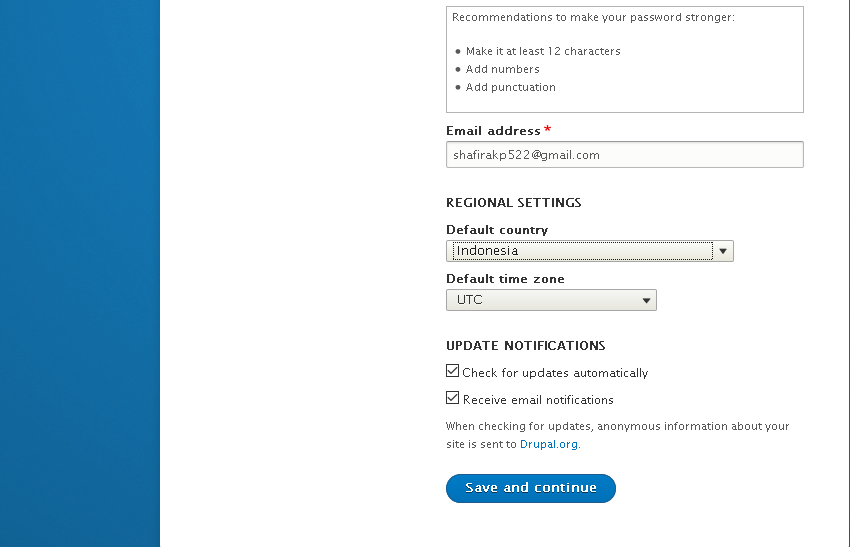

# Instalasi Drupal

1. Membuat folder Minggu-12 pindah ke direktori tersebut, kemudian membuat direktori my_drupal dan pindah ke direktori tersebut.

 .

2. Membuat file docker-compose.yml, kemudian di dalam file tersebut ketikkan perintah seperti di bawah ini. Pada file ini akan membuat 2 container drupal yaitu menggunakan imae drupal:latest dan postgres:10. rupal dapat diakses menggunakan port 8088 dan drupal menggunakan port 5432.

 .

3. Menjalankan file docker-compose.yml dengan perintah docker-compose up -d.

 .

4. Melihat container yang sudah ada dengan perintah docker ps.

 .

5. Mengakses drupal ke URL http://127.0.0.1:8088 , untuk halaman yang muncul adalah halaman memilih bahasa, saya memilih bahasa inggris kemudian klik save and continue.

 .

6. Memilih Profil instalasi, disini saya memilih profil standard.

 .

7. Konfigurasi database, isi field sesuai dengan yang ada pada file docker-compose.yml.

 .

8. Pada step 7 setelah selesai mengisi kemudian klik save and continue. Dan akan memasuki proses instalasi Drupal.

 .

9. Konfigurasi Site, mengisi field .

10. Jika proses instalasi selesai maka akan muncul tampilan seperti di bawah ini .

