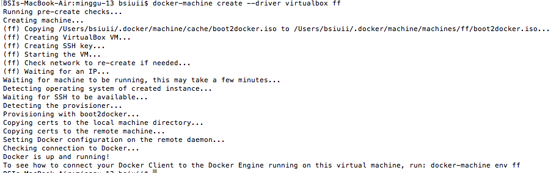
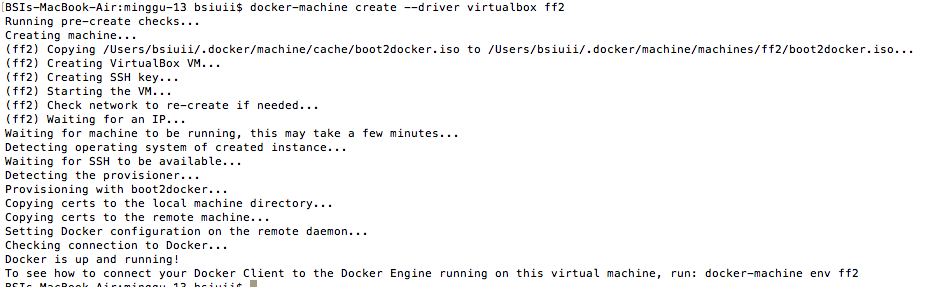
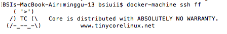
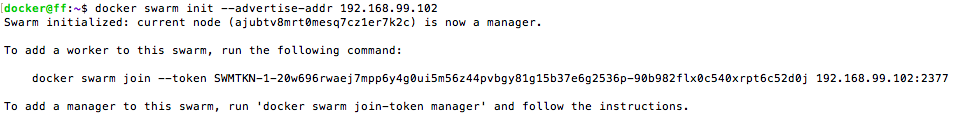
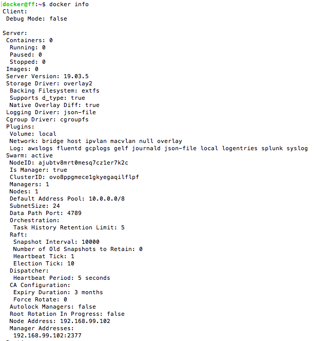
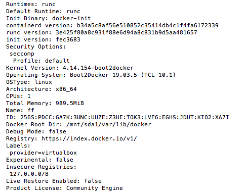
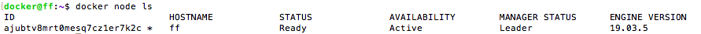
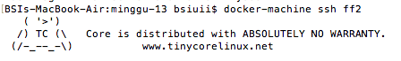
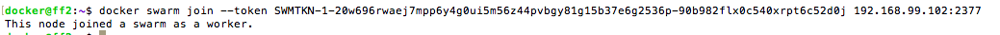
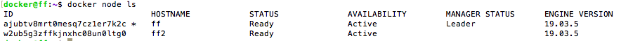

# Docker Swarm

1. Membuat VMs dengan nama ff dan ff2 menggunakan docker machine
.

.

2. Membuat ff menjadi swarm manager dengan ssh ke mesin ff kemudian menjalankan perintah docker swarm init --advertise-addr 192.168.99.102.

.

.

3. Docker info berfungsi untuk melihat status pada swarm.

.

.

4. Perintah docker node ls berfungsi melihat informasi node.

.

5. SSH mesin ff2

.

6. Join ff2 ke swarm ff.

.

7. Connect ke ff, dan jalankan perintah di bawah ini.

.
