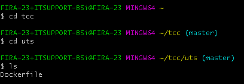
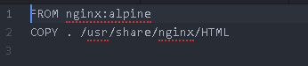
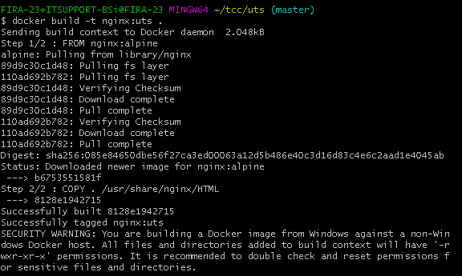
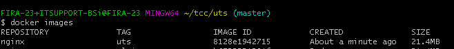
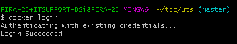
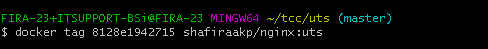
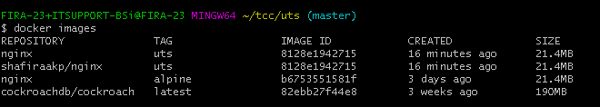
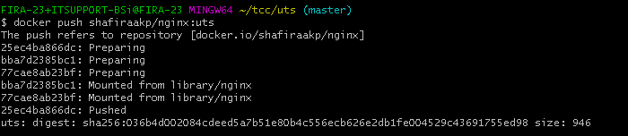
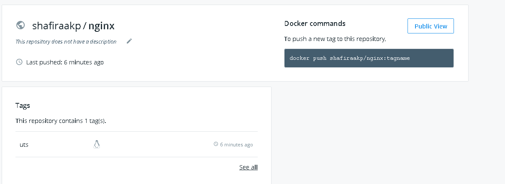

*Pengertian Docker*
Docker adalah sebuah proyek yang bersifat open source dibawah lisensi Apache Versi 2.0 yang bisa dipergunakan secara gratis oleh developer dan berfungsi sebagai wadah atau container untuk memasukkan sebuah aplikasi secara lengkap beserta semua hal lainnya yang dibutuhkan sehingga dapat berjalan dimana saja.
Dalam hal ini, developer atau sysadmin dapat menjalankan aplikasi di mana pun misalnya di laptop, data center, virtual machine dan cloud.
Docker adalah salah satu platform yang dibangun berdasarkan teknologi container.
Docker merupakan sebuah project open-source yang menyediakan platform terbuka untuk developer maupun sysadmin untuk dapat membangun, mengemas, dan menjalankan aplikasi dimanapun sebagai sebuah wadah (container) yang ringan.

*Pengertian PaaS*

Platform as a service (PaaS) adalah kategori layanan komputasi cloud yang menyediakan platform yang memungkinkan pelanggan untuk mengembangkan, menjalankan, dan mengelola aplikasi tanpa kompleksitas membangun dan memelihara infrastruktur yang biasanya terkait dengan pengembangan dan peluncuran aplikasi.
PaaS dapat disampaikan dalam dua cara :
sebagai publik layanan cloud dari penyedia, di mana konsumen kontrol penyebaran perangkat lunak dengan sedikit pilihan konfigurasi, dan provider yang menyediakan jaringan, server, penyimpanan, OS, 'middleware' (yaitu; java runtime, .net runtime, integrasi, dll.), database dan layanan lainnya untuk menjadi tuan rumah konsumen aplikasi,
atau sebagai layanan pribadi (perangkat lunak atau alat) di dalam firewall, atau sebagai perangkat lunak yang digunakan pada public infrastructure as a service.

*Pengertian SaaS*

SaaS (software as a service atau perangkat lunak berbentuk layanan) adalah suatu model penyampaian aplikasi perangkat lunak oleh suatu vendor perangkat lunak yang mengembangkan aplikasi web yang diinangi dan dioperasikan (baik secara mandiri maupun melalui pihak ketiga) untuk digunakan oleh pelanggannya melalui Internet.
Pelanggan tidak mengeluarkan uang untuk memiliki perangkat lunak tersebut melainkan hanya untuk menggunakan. Pelanggan menggunakan perangkat lunak tersebut melalui antarmuka pemrograman aplikasi yang dapat diakses melalui web dan seringkali ditulis menggunakan layanan web atau REST.
# Keterkaitan antara SaaS, PaaS dan dockerfile

# Upload File ke Docker Hub
1. cd tcc : masuk ke folder tcc
   cd uts : masuk ke folder uts
   membuat file docker file seperti di bawah ini

   

   DockerFile tersebut menggunakan nginx :alpine
   meng-copy semua file di working directory (di folder uts) ke direktory /usr/share/nginx/html di image nginx.
   ls : melihat file yang ada di folder uts : sebelumnya sudah membuat file bernama Dockerfile yang bisa diakses di https://github.com/shafirakp/tcc/blob/master/uts/Dockerfile

  

2. Membuat image nginx menggunakan file docker file tersebut dengan perintah : docker build -t (nama image:tag) . titik digunakan untuk mendeklarasikan bahwa dockerfile yang akan digunakan terdapat pada directory tersebut. Perintah tersebut akan membuat image baru berdasarkan apa yang kita tulis di DocerFile. Jadi docker build akan mengambil image nginx:alphine dan mencopy semua yang working di direktoryke dalam folder/usr/share/nginx/html. Setelah selesai meng copy, membuat image baru dengan nama shafiraakp/nginx (nomer 5)

  

3. docker images : untuk melihat hasil docker image yang berhasil di buat.

  

Sebelum mengupload docker image ke docker hub harus login terlebih dahulu. Setelah itu akan muncul halaman login dan login menggunakan akun yang sudah di buat.
4. docker login : untuk login ke docker

   

5. docker tag 8128e1942715 shafiraakp/nginx:uts : docker imahe yang akan di push ke docker hub harus diganti nama imagenya menggunakan shafiraakp/nginx: uts, shafiraakp merupakan username dokcerhub, nginx adalah aplikasinya dan uts adalah tag yang di buat. Harus menggunakan username agar saat image di push akan tertuju ke docker id kita.

  

6. docker image

  

7. docker push shafiraakp/nginx : uts : upload docker image yang sudah diganti taggingnya.

  

8. jika sudah berhasil di push maka akan muncul image yang telah di push pada docker hub kita . Untuk mengakses nginx tersebut dapat diakses di URL https://hub.docker.com/r/shafiraakp/nginx/tags

9. Docker images adalah sebuah template yang bersifat read only. Template ini sebenarnya adalah sebuah OS yang telah diinstall berbagai aplikasi. Docker images berfungsi untuk membuat docker container, menggunakan 1 docker images kita dapat membuat banyak docker container.
